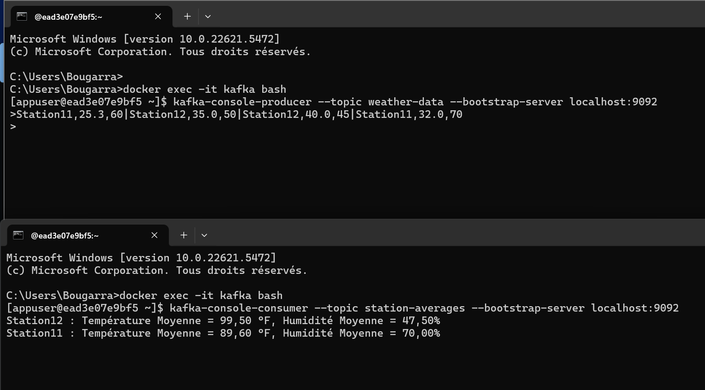
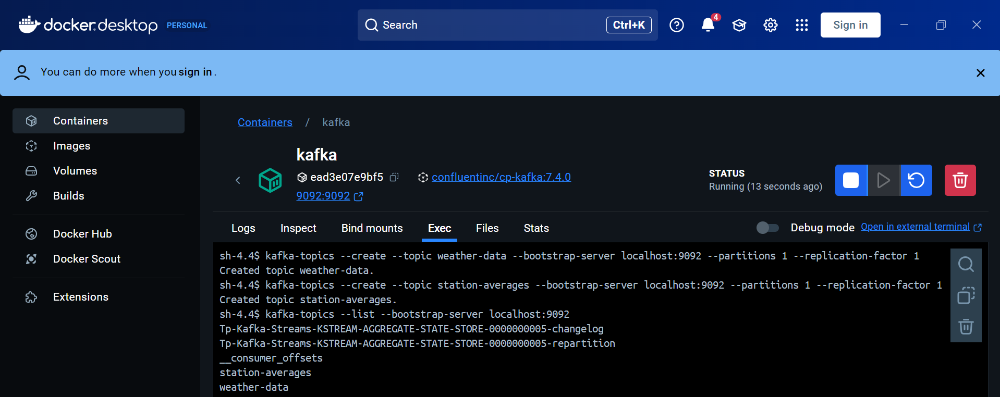

# Analyse de Données Météorologiques
#### Une entreprise collecte des données météorologiques en temps réel via Kafka. Chaque station météorologique envoie des messages dans le topic Kafka nommé 'weather-data'.
#### Les messages ont le format suivant : station,temperature,humidity
#### - station : L'identifiant de la station (par exemple, Station1, Station2, etc.).
#### - temperature : La température mesurée (en °C, par exemple, 25.3).
#### - humidity : Le pourcentage d'humidité (par exemple, 60).

### Das cet exemple j'ai :
#### - Utilisé les concepts de KStream, KTable, et KGroupedStream.
#### - Géré les données en assurant une sérialisation correcte.
#### - Assuré un arrêt propre de l'application en ajoutant un hook.

### Exemple de Résultat

### Création les topics Kafka
